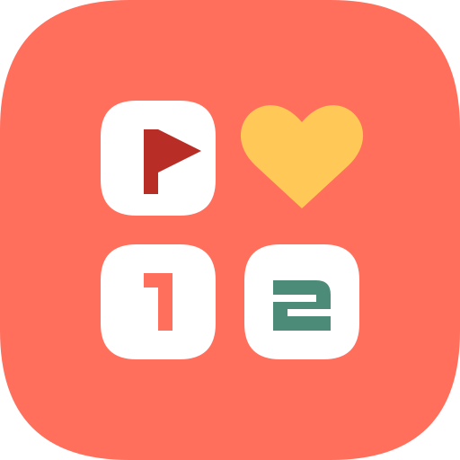

# 하루지뢰찾기



**한 칸씩, 기분 좋은 하루.**

하루닿음(Semantle)·하루일본어(Japanese Conversation)와 같은 코랄·화이트 테마로 만든 안드로이드 지뢰찾기입니다. 작은 하트와 다정한 문장을 담아 선물처럼 가볍게 즐길 수 있습니다.

## 다운로드

[최신 APK와 설치 안내](https://github.com/ilvy22/minesweeper/releases/latest)

- Android 8.0 이상에서 설치할 수 있습니다.
- 릴리스의 `HaruMinesweeper-v1.0.0.apk`를 휴대폰에 내려받아 열어 주세요.
- 휴대폰에서 안내하면 다운로드에 사용한 브라우저/파일 앱에 ‘이 출처의 앱 설치’를 허용하세요.
- Google Play 배포본이 아닌 직접 설치용 서명된 디버그 APK입니다. 패키지 이름은 `com.harudaeum.minesweeper`입니다.
- 설치 파일의 SHA256은 릴리스의 `.sha256` 파일로 확인할 수 있습니다.

## 플레이

| 난이도 | 보드 | 지뢰 |
| --- | --- | --- |
| 하 · 가볍게 | 9 × 9 | 10개 |
| 중 · 차근차근 | 12 × 12 | 24개 |
| 상 · 도전 | 16 × 16 | 50개 |

- **첫 칸과 주변 8칸 안전**: 첫 실제 열기 이후 지뢰를 배치합니다.
- **편한 조작**: 탭해서 열기, 길게 눌러 깃발, 별도의 깃발 모드, 숫자 주변 칸 함께 열기.
- **큰 보드 지원**: 칸 크기 조절과 상하좌우 스크롤.
- **정확한 플레이 시간**: 첫 칸부터 시작하며 일시정지·다른 탭·백그라운드에서는 멈춥니다. 중지 중에는 보드를 숨깁니다.
- **자동 저장과 이어하기**: 조작 직후 저장하고 재실행 시 멈춘 상태로 복원합니다. 플레이 중 시간은 5초마다 추가 저장합니다.
- **기록**: 난이도별 역대 최고 기록, 최근 완료한 200판, 성공률과 연속 성공, 결과 텍스트 공유. 오래된 판이 목록에서 빠져도 최고 기록은 유지합니다.
- **편안한 화면**: 시스템/밝은/어두운 테마, 선택 가능한 작은 진동, 친절한 게임 방법.
- **다정한 마무리**: 성공과 실패 모두 부담 없이 다음 한 판으로 이어지는 문장.

깃발의 위치가 틀리면 주변 칸 함께 열기에서 지뢰를 밟을 수 있습니다. 첫 칸의 안전을 보장하며, 모든 판이 추측 없이 풀린다고 보장하지는 않습니다. 진행 중 새 게임을 선택하면 확인 후 기존 판을 교체합니다. 중도 교체한 판은 완료 기록에 포함하지 않습니다.

## 데이터

인터넷·회원가입·광고·추적 SDK 없이 동작합니다. 별도의 사용자 권한 허용이 필요하지 않습니다. 게임과 기록은 앱 전용 저장 공간에 보관하며 자동 클라우드/기기 이전 백업을 사용하지 않습니다. 앱을 삭제하면 기록도 삭제됩니다. 기록 초기화는 진행 중인 게임을 유지하고 완료 기록과 최고 기록을 지웁니다. 손상된 저장 원본은 조용히 덮어쓰지 않고 보관합니다.

## 개발 환경

- Kotlin 2.1.20 / Jetpack Compose / Material 3
- JDK 17 / Gradle 8.11.1 / Android Gradle Plugin 8.9.2
- compileSdk·targetSdk 36 / minSdk 26
- 외부 서비스, API 키, 서버 불필요

### Windows 빌드

JDK 17과 Android SDK 36을 설치한 뒤 실행합니다. 최초 빌드에서는 의존성을 받을 네트워크가 필요합니다.

```powershell
.\scripts\build-android.ps1 -JavaHome 'C:\path\to\jdk-17' -AndroidSdk 'C:\path\to\android-sdk'
```

스크립트가 앱별 서명키를 생성하고 APK·단위 테스트·Lint 검사를 실행합니다. 결과는 `dist/`에 생성됩니다. 캐시가 있는 환경에서는 `-Offline`을, 기존 Gradle 또는 캐시를 사용하려면 `-Gradle`, `-GradleUserHome`, `-ReadOnlyDependencyCache`를 지정할 수 있습니다.

### macOS / Linux 빌드

`JAVA_HOME`과 `ANDROID_HOME`을 지정하고 아래를 실행합니다.

```sh
mkdir -p .android
if [ ! -f .android/debug.keystore ]; then
  keytool -genkeypair -keystore .android/debug.keystore -storepass android \
    -alias androiddebugkey -keypass android -keyalg RSA -keysize 2048 \
    -validity 10950 -dname 'CN=Android Debug,O=Haru Minesweeper,C=KR' -noprompt
fi
./gradlew :app:assembleDebug :app:testDebugUnitTest :app:lintDebug
```

APK: `app/build/outputs/apk/debug/app-debug.apk`

**업데이트를 계속 설치하려면 `.android/debug.keystore`를 개인적으로 보관해야 합니다.** 서명키는 Git에 포함되지 않습니다. 새 키로 만든 APK는 기존 APK와 서명이 다르므로 그대로 덮어 설치할 수 없습니다. CI는 검증용으로 별도 키를 생성하며, 사용자에게 배포하는 업데이트는 보관된 원래 키로 빌드합니다. Google Play 배포 시에는 별도의 정식 서명 설정이 필요합니다.

## 소스 구조

```text
app/src/main/java/com/harudaeum/minesweeper/
  game/       Android에 의존하지 않는 순수 게임 규칙
  data/       타이머, 기록, 저장 형식, 게임 컨트롤러
  ui/         플레이·기록·도움말·설정·시리즈 공통 컴포넌트
  ui/theme/   하루 시리즈 색상·타이포그래피
app/src/test/ 게임 규칙과 타이머·기록 테스트
docs/         디자인 기준과 검증 기록
```

[디자인 기준](docs/BRAND.md) · [검증 범위](docs/QA.md)
